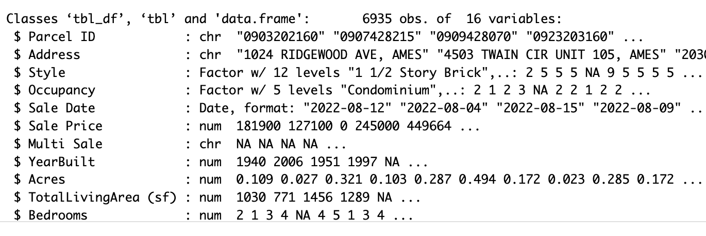

<!-- README.md is generated from README.Rmd. Please edit the README.Rmd file -->

```{r setup, include=FALSE}
knitr::opts_chunk$set(echo = TRUE)
```

# Lab report #1

Follow the instructions posted at <https://ds202-at-isu.github.io/labs.html> for the lab assignment. The work is meant to be finished during the lab time, but you have time until Monday evening to polish things.

Include your answers in this document (Rmd file). Make sure that it knits properly (into the md file). Upload both the Rmd and the md file to your repository.

All submissions to the github repo will be automatically uploaded for grading once the due date is passed. Submit a link to your repository on Canvas (only one submission per team) to signal to the instructors that you are done with your submission.

1.  

In this data set, there are 6835 observations of 16 variables. The variables present and their corresponding types are as shown below, each variable representing what they're titled.



Additionally, for the numeric variables, below are the listed data ranges: Sale Price: 0 - 20500000, YearBuilt: 0 - 2022, Acres: 0.0000 - 12.0120, TotalLivingArea (sf): 0 - 6007, Bedrooms: 0 - 10, FinishedBsmtArea (sf): 10 - 6496, LotArea (sf): 0 - 523228

```{r}
library(classdata)
summary(ames)
```

2.  The variable of special interest is Sale Price.

3.  Sale Price is the main variable. The range of sale price is 0 - 20500000. The general pattern is that there is a large skew in the data, where the count of sales price concentrates to the left at 0. Some oddities include the two outliers that lie to the right at a significantly higher sale price.

```{r}
library(ggplot2)

ggplot(ames, aes(x = `Sale Price`)) +
  geom_histogram(bins = 50, fill = "skyblue", color = "black") +
  labs(title = "Distribution of Sale Price in Ames",
       x = "Sale Price ($)",
       y = "Count") +
  theme_minimal()
```

4.  Sarah's work: Variable picked = Acres

The variable Acres ranges from 0.0000 to 12.0120. Its distribution is skewed, with most properties concentrated at lower acreages like 0, a pattern that mirrors the skew observed in Sale Price, which is similarly concentrated at lower values like 0.

The scatterplot shows that most properties cluster at the lower end of the graph, indicating they have both small acreage and low sale prices. This general trend is  skewed by several extreme outliers where the highest sale prices occur on properties with negligible lot sizes (near 0 acres). These implies that those values are driven may be driven by factors like location or building features, not the land area itself. Likewise, the two other outliers where plots of large acres have a ~0 sale price indicates that they may not be on the market to sell

```{r}
library(ggplot2)

#Acres Histogram
ggplot(ames, aes(x = `Acres`)) + geom_histogram(bins = 50, fill = "skyblue", color = "black") + labs(title = "Distribution of Acres in Ames", x = "Acres", y = "Count") + theme_minimal()

#Scatterplot
ggplot(ames, aes(x = `Acres`, y = `Sale Price`)) +
  geom_point(alpha = 0.5) +
  labs(title = "Sale Price vs Acres") +
  theme_minimal()

```
