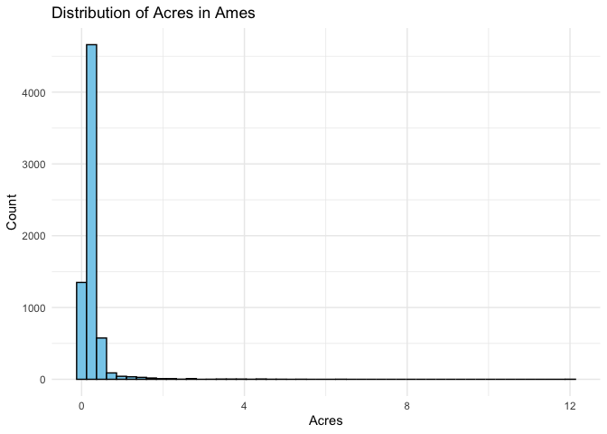
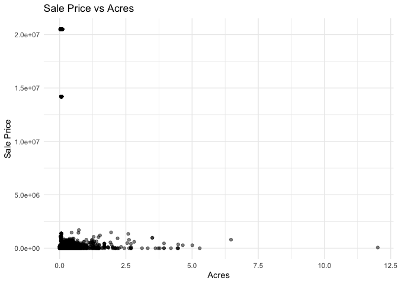

<!-- README.md is generated from README.Rmd. Please edit the README.Rmd file -->

# Lab report \#1

Follow the instructions posted at
<https://ds202-at-isu.github.io/labs.html> for the lab assignment. The
work is meant to be finished during the lab time, but you have time
until Monday evening to polish things.

Include your answers in this document (Rmd file). Make sure that it
knits properly (into the md file). Upload both the Rmd and the md file
to your repository.

All submissions to the github repo will be automatically uploaded for
grading once the due date is passed. Submit a link to your repository on
Canvas (only one submission per team) to signal to the instructors that
you are done with your submission.

1.  

In this data set, there are 6835 observations of 16 variables. The
variables present and their corresponding types are as shown below, each
variable representing what they’re titled.


Additionally, for the numeric variables, below are the listed data
ranges: Sale Price: 0 - 20500000, YearBuilt: 0 - 2022, Acres: 0.0000 -
12.0120, TotalLivingArea (sf): 0 - 6007, Bedrooms: 0 - 10,
FinishedBsmtArea (sf): 10 - 6496, LotArea (sf): 0 - 523228

``` r
library(classdata)
summary(ames)
```

    ##   Parcel ID           Address                        Style     
    ##  Length:6935        Length:6935        1 Story Frame    :3732  
    ##  Class :character   Class :character   2 Story Frame    :1456  
    ##  Mode  :character   Mode  :character   1 1/2 Story Frame: 711  
    ##                                        Split Level Frame: 215  
    ##                                        Split Foyer Frame: 156  
    ##                                        (Other)          : 218  
    ##                                        NA's             : 447  
    ##                           Occupancy      Sale Date            Sale Price      
    ##  Condominium                   : 711   Min.   :2017-07-03   Min.   :       0  
    ##  Single-Family / Owner Occupied:4711   1st Qu.:2019-03-27   1st Qu.:       0  
    ##  Townhouse                     : 745   Median :2020-09-22   Median :  170900  
    ##  Two-Family Conversion         : 139   Mean   :2020-06-14   Mean   : 1017479  
    ##  Two-Family Duplex             : 182   3rd Qu.:2021-10-14   3rd Qu.:  280000  
    ##  NA's                          : 447   Max.   :2022-08-31   Max.   :20500000  
    ##                                                                               
    ##   Multi Sale          YearBuilt        Acres         TotalLivingArea (sf)
    ##  Length:6935        Min.   :   0   Min.   : 0.0000   Min.   :   0        
    ##  Class :character   1st Qu.:1956   1st Qu.: 0.1502   1st Qu.:1095        
    ##  Mode  :character   Median :1978   Median : 0.2200   Median :1460        
    ##                     Mean   :1976   Mean   : 0.2631   Mean   :1507        
    ##                     3rd Qu.:2002   3rd Qu.: 0.2770   3rd Qu.:1792        
    ##                     Max.   :2022   Max.   :12.0120   Max.   :6007        
    ##                     NA's   :447    NA's   :89        NA's   :447         
    ##     Bedrooms      FinishedBsmtArea (sf)  LotArea(sf)          AC           
    ##  Min.   : 0.000   Min.   :  10.0        Min.   :     0   Length:6935       
    ##  1st Qu.: 3.000   1st Qu.: 474.0        1st Qu.:  6553   Class :character  
    ##  Median : 3.000   Median : 727.0        Median :  9575   Mode  :character  
    ##  Mean   : 3.299   Mean   : 776.7        Mean   : 11466                     
    ##  3rd Qu.: 4.000   3rd Qu.:1011.0        3rd Qu.: 12088                     
    ##  Max.   :10.000   Max.   :6496.0        Max.   :523228                     
    ##  NA's   :447      NA's   :2682          NA's   :89                         
    ##   FirePlace                            Neighborhood 
    ##  Length:6935        (27) Res: N Ames         : 854  
    ##  Class :character   (37) Res: College Creek  : 652  
    ##  Mode  :character   (57) Res: Investor Owned : 474  
    ##                     (29) Res: Old Town       : 469  
    ##                     (34) Res: Edwards        : 444  
    ##                     (19) Res: North Ridge Hei: 420  
    ##                     (Other)                  :3622

2.  The variable of special interest is Sale Price.

3.  Sale Price is the main variable. The range of sale price is
    0 - 20500000. The general pattern is that there is a large skew in
    the data, where the count of sales price concentrates to the left
    at 0. Some oddities include the two outliers that lie to the right
    at a significantly higher sale price.

``` r
library(ggplot2)

ggplot(ames, aes(x = `Sale Price`)) +
  geom_histogram(bins = 50, fill = "skyblue", color = "black") +
  labs(title = "Distribution of Sale Price in Ames",
       x = "Sale Price ($)",
       y = "Count") +
  theme_minimal()
```

<!-- -->

4.  Sarah’s work: Variable picked = Acres

The variable Acres ranges from 0.0000 to 12.0120. Its distribution is
skewed, with most properties concentrated at lower acreages like 0, a
pattern that mirrors the skew observed in Sale Price, which is similarly
concentrated at lower values like 0.

The scatterplot shows that most properties cluster at the lower end of
the graph, indicating they have both small acreage and low sale prices.
This general trend is skewed by several extreme outliers where the
highest sale prices occur on properties with negligible lot sizes (near
0 acres). These implies that those values are driven may be driven by
factors like location or building features, not the land area itself.
Likewise, the two other outliers where plots of large acres have a ~0
sale price indicates that they may not be on the market to sell

``` r
library(ggplot2)

#Acres Histogram
ggplot(ames, aes(x = `Acres`)) + geom_histogram(bins = 50, fill = "skyblue", color = "black") + labs(title = "Distribution of Acres in Ames", x = "Acres", y = "Count") + theme_minimal()
```

    ## Warning: Removed 89 rows containing non-finite outside the scale range
    ## (`stat_bin()`).

<!-- -->

``` r
#Scatterplot
ggplot(ames, aes(x = `Acres`, y = `Sale Price`)) +
  geom_point(alpha = 0.5) +
  labs(title = "Sale Price vs Acres") +
  theme_minimal()
```

    ## Warning: Removed 89 rows containing missing values or values outside the scale range
    ## (`geom_point()`).

<!-- -->
